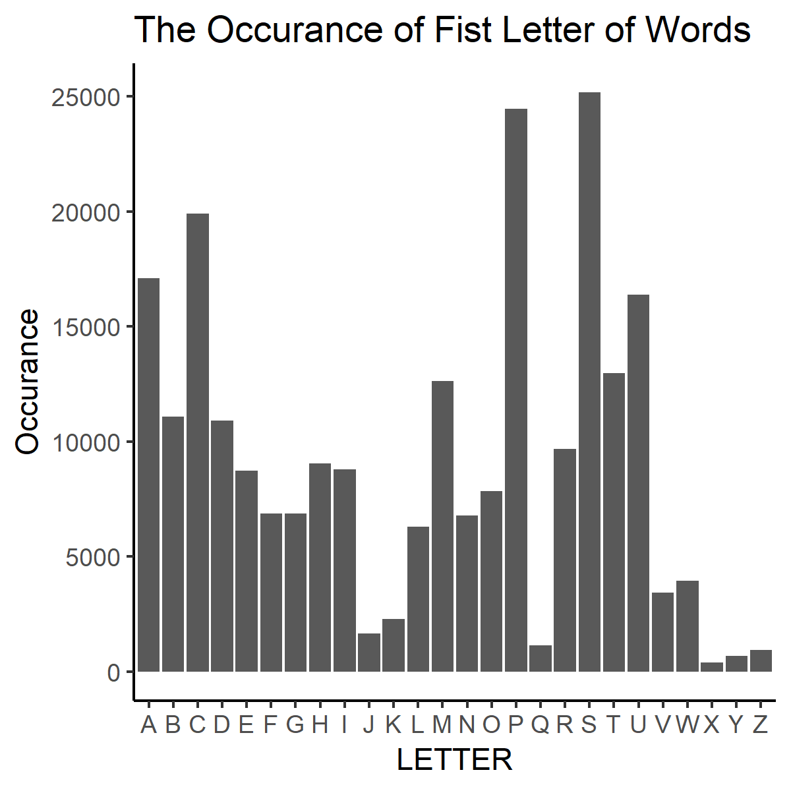

This is the Homework 9 Repository for Zhenyi Huang
=============

##Goal 

The Goal of the assignment is to:

  * How to run an R script non-interactively
  * How to use `make`
    - to record which files are inputs vs. intermediates vs. outputs
    - to capture how scripts and commands convert inputs to outputs
    - to re-run parts of an analysis that are out-of-date
  * The intersection of R and `make`, i.e. how to
    - run snippets of R code
    - run an entire R script
    - render an R Markdown document (or R script)
  * The interface between RStudio and `make`
  * How to use `make` from the shell
  * How Git facilitates the process of building a pipeline
  
## Files
In this assignment, the R script file [`analyse_Words.R`](https://github.com/STAT545-UBC-students/hw09-janehuang1647/blob/master/analyse_Words.R) is added, the [`Makefile`](https://github.com/STAT545-UBC-students/hw09-janehuang1647/blob/master/Makefile), [`report.rmd`](https://github.com/STAT545-UBC-students/hw09-janehuang1647/blob/master/report.rmd) and [`report.html`](https://github.com/STAT545-UBC-students/hw09-janehuang1647/blob/master/report.html) are modified or updated. Some files are automatically generated as outputs, which include:

*  [frist_letter_frequency.tsv](https://github.com/STAT545-UBC-students/hw09-janehuang1647/blob/master/first_letter_frequency.tsv)
*  [first_letter_freq.png](https://github.com/STAT545-UBC-students/hw09-janehuang1647/blob/master/first_letter_freq.png)

Please check the modified version of `Makefile` here: [`Makefile` file link](https://github.com/STAT545-UBC-students/hw09-janehuang1647/blob/master/Makefile)

## Brief Introduction

In the added R-script, we have extract the data from `words.txt` and count the number of occurance of first letter for individual word. The `Makefile` use  `make` `all: report.html` to generate a frequency table and a bar-plot to show the occurance of each letter, which is shown below. As we can see from the graph, the most frequent first letter is __S__ followed by __P__ and __C__. If you would like to explore more, you can check the original R script: [analyse_Words.R](https://github.com/STAT545-UBC-students/hw09-janehuang1647/blob/master/analyse_Words.R)

## Reference

*  http://stat545.com/automation04_make-activity.html#appendix
*  https://bitaesthetics.com/posts/make-for-data-scientists.html

