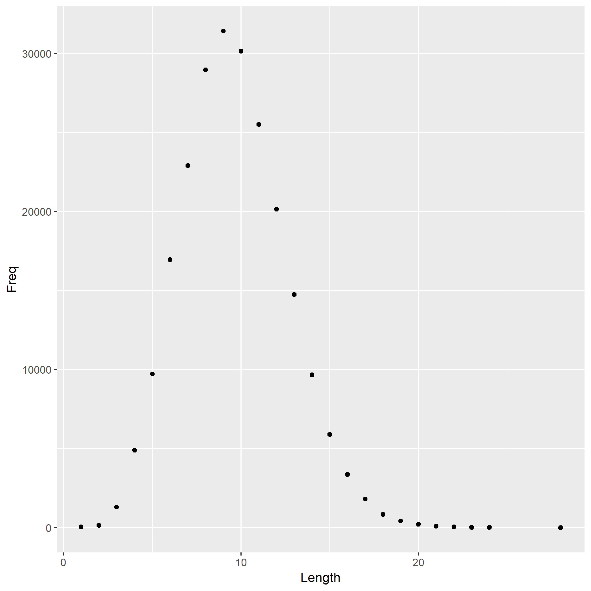

This R markdown file is adapted from Jenny Bryan, and it is further edited by adding additional R scripts and comments. 


On most *nix systems, the file `/usr/share/dict/words` contains a bunch of words. On my machine, it contains 235970 words.

I computed the length of each word, i.e. the number of characters, and tabulated how many words consist of 1 character, 2 characters, etc.

The most frequent word length is 9.

Here is a histogram of word lengths.




Furthermore, it is worth analysing that which is the most frequent first letter of words. Below shows the frequency table shows the occurance of each letter.


```r
data <- read.delim("first_letter_frequency.tsv")
knitr::kable(data)
```


Letter    occurance
-------  ----------
A             17104
B             11077
C             19908
D             10900
E              8738
F              6865
G              6862
H              9033
I              8800
J              1643
K              2284
L              6290
M             12621
N              6784
O              7850
P             24462
Q              1152
R              9676
S             25170
T             12969
U             16390
V              3440
W              3947
X               385
Y               671
Z               949

In addition, this is the bar-plot of the frequency of various letters. 


