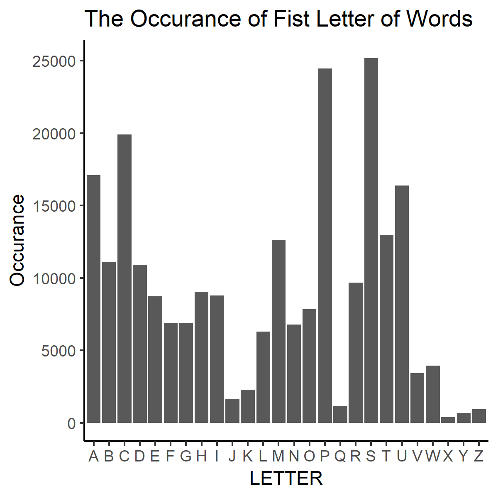

This R markdown file is adapted from Jenny Bryan, and it is further edited by adding additional R scripts and comments. 


```{r load-hist-dat, include = FALSE}
hist_dat <- read.delim("histogram.tsv")
```

On most *nix systems, the file `/usr/share/dict/words` contains a bunch of words. On my machine, it contains `r sum(hist_dat$Freq)` words.

I computed the length of each word, i.e. the number of characters, and tabulated how many words consist of 1 character, 2 characters, etc.

The most frequent word length is `r with(hist_dat, Length[which.max(Freq)])`.

Here is a histogram of word lengths.


Furthermore, it is worth analysing that which is the most frequent first letter of words. Below shows the frequency table shows the occurance of each letter.


```{r}
data <- read.delim("first_letter_frequency.tsv")
knitr::kable(data)
```

In addition, this is the bar-plot of the frequency of various letters. 



